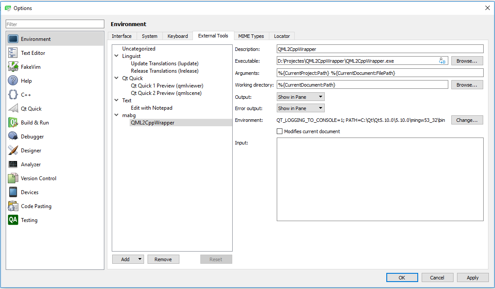

# QML2CppWrapper - C++ wrapper generator for QML

One of the most tedious work an error prune on QML is create a C++ wrapper for a QML file. A lot of times the C++ wrapper and the QML aren't synchronized, because when changes QML forgets to change the C++ code or the code changed are incorrectly with the QML definition. Another error prone and tedious work is create all the signal/slot connections. Like only SIGNAL and SLOT macro is possible, a type error can't be detected by the compiler. Moreover, if a model is used, you must to create a class that subclass QAbstractListModel for support the model used on the QML file and define all the roles needed. All the type errors only appears at runtime, increasing development time and bugs.

QML2CppWrapper reads a QML file and creates automatically C++ code to wrap all this repetitive work and allow to appear bugs on compile time.

## How it works?

The main idea is create a base file that always are changed when the generator runs and another file that you subclass with your code that never is changed. Like the base file always change depending on the QML file, if some inconsistences occurs with QML and your subclassed code, a compilation error appears, and errors are detected at compile time.

For a QML file, it can create different files, depending on what it find. If the QML file name is sample.qml, it creates these files:

- sampleGenerated.h and sampleGenerated.cpp: These files contains the C++ wrapper code. It **always are generated** every time the generator is invoked.
- sample.h and sample.cpp: In these files you put your code. It is **only generated if doesn't exists**. 
- sampleModelGenerated.h and sampleModelGenerated.cpp: These files contains C++ code for the model used in the QML file. **Only is generated if the QML file uses a model** and **always are generated** every time the generator is invoked.
- sampleModel.h and sampleModel.cpp: In these files you put your model code. It is **only generated if the QML file uses a model** and if **doesn't exists**. 

### Generation rules

For sampleGenerated.h and sampleGenerated.cpp:

- For every signal, it generates an abstract virtual slot method.
- For every property, it generates a protected const getter method. If it isn't readonly it also generates a set method.
- For every context property, it can generate different things, depends on it's role. The generator only looks at context properties that starts with the **prefix c__**. 
  - If the role is a model, it creates a protected field that references a class that wraps the model.
  - If not, it creates three methods: a getter, a setter and a value initializer.
- For every objectName property, it generates a method to access that object. If the object is a QQuickItem, adds a method that allows to embed another widget inside this.

For sample.h and sample.cpp:

- The class is inheriting the sampleGenerated class.
- All virtual abstract methods are overrided.

For sampleModelGenerated.h and sampleModelGenerated.cpp:

- The class is inherited from QAbstractListModel and overrides roleNames().

- Creates a protected enum with the roles found on the qml file.

For sampleModel.h and sampleModel.cpp:

- The rowCount and data are overrided and filled with a default implementation.

  

See [NewStudentView.qml](sample.md) as a simple example without model or context properties.

See [StudentsView.qml](sampleModel.md) as a simple example with a model and a context property.

**Warning!**. The generator instances the qml file to obtain by RTTI the type of the properties and parameters, so the qml file must be well formed and instanciable. To test if the qml is correct, use the external tool *Qt Quick 2 Preview (qmlscene)*. In case that the generator is invoked with a malformed qml, the code generated could be incomplete.

## Installation

- Download the code and compile it with Qt Creator.

- On Qt Creator, configure an external tool (Tools \ External \ Configure...).

  - On *Executable*, put the path to your compiled exe.

  - On *Arguments*, %{CurrentProject:Path} %{CurrentDocument:FilePath}

  - On *Working directory*, %{CurrentDocument:Path}

  - On *Environment*, PATH=*The path of your Qt installation with the compiler used to compile the code*;QT_LOGGING_TO_CONSOLE=1

    For exemple, if you use Qt 5.10, installed on C: and mingw53_32 is used to compile it, the environment variable must be: PATH=C:\Qt\Qt5.10.0\5.10.0\mingw53_32\bin;QT_LOGGING_TO_CONSOLE=1

    
    
## How to use it?

- Open a qml file on Qt Creator.
- Execute the generator selecting the new external configuration on Tools \ External. It's recommended to create a shortcut to it.
  - The generator creates the files in the same directory of the qml file.

## Test

With the QML2CppWrapper project opened on Qt Creator, open the file sample\NewStudenView.qml and execute the generator. Try it also with sample\StudentsView.qml. See the generated files on the sample directory.